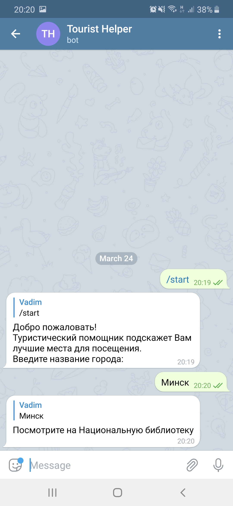
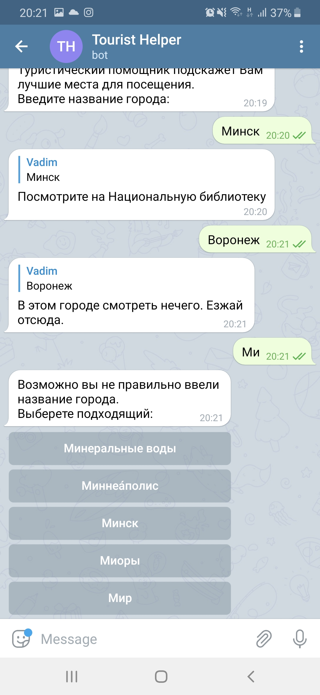

## Test Task
Необходимо создать web приложение по управлению собственным туристическим телеграм ботом.

    1. Телеграм бот выдает пользователю справочную информацию о введенном городе. 
    Например, пользователь вводит: «Москва», чат-бот отвечает: «Не забудьте посетить Красную Площадь. Ну а в ЦУМ можно и не заходить)))».
    2. Данные о городах должны храниться в базе данных.
    3. Управлять данными о городах (добавлять новые города и информацию о них, изменять и удалять любую информацию) необходимо через REST WebService.

    Используемые технологии: SpringBoot, SpringMVC, SpringData, Hibernate, Java не ниже 1.8. Для сборки проекта использовать Maven.
    Исходный код приложения должен быть залит на GitHub, в файле readme указать, что необходимо для запуска (в том числе имя телеграм бота и его токен).

## Install
* Версия Java 11  
* Скрипт для создания базы и заполнения `src/main/resources/initDB.sql`. Указать информацию о БД `spring.datasource.url`, `spring.datasource.username`, `spring.datasource.password`, `spring.jpa.properties.hibernate.dialect` в `application.properties`.  
* Имя бота _@vadtel_travel_bot_. Все данные внесены в `application.properties`.  
* Сборка `mvnw clean package` - на выходе получим WAR в папке target. Переименовать в ROOT.war, положить в папку Tomcat/webapps - удалив оттуда все. Запустить tomcat  
* Либо `mvnw spring-boot:run` - сервер запуститься и будет доступен по http://localhost:8080/


#### Telegram Bot




### REST web-service(No Auth)
* **GET /api/city/{id}** - Получение города по ID.
* **GET /api/city** - Получение списка всех городов: 

```json
{
   "id": 8,
   "cityName": "Миоры",
   "cityInfos": [
       {
           "id": 11,
           "cityInfo": "Римско-католическая церковь Вознесения Девы Марии (1907)"
       },
       {
           "id": 12,
           "cityInfo": "Скульптура «Журавлиная верность»"
       }
   ]
}
```

* **POST /api/city** Создание города. Можно отправлять в нескольких вариантах
```json
{
    "cityName": "Кривошин"
}
```
```json
{
    "cityName": "Барановичи",
    "cityInfos": [
        {
            "cityInfo": "Не забудьте посетить Барановичский музей железной дороги."
        },
        {
            "cityInfo": "Обязательно попробуйте Лодочку"
        }
    ]
}
```
* **PUT /api/city/{id}** Обновление города по ID. Можно отправлять в нескольких вариантах
> Отправить список CityInfo. Информация о городе добавится к существующим местам.
```json
{
	 "cityInfos": [
        {
            "cityInfo": "Психиатрическую больницу «Кривошин» лучше не посещать"
        }
    ]
}
```
> Отправить имя города. Имя города обновится. Информация о городе останется прежней
```json
{	
    "cityName": "Кривошин"
}
```
> Либо объеденить. Имя заменится. Информация о городе добавится к существующим местам.
```json
{
	 "cityName": "Кривошин",
	 "cityInfos": [
        {
            "cityInfo": "Психиатрическую больницу «Кривошин» лучше не посещать"
        }
    ]
}
```

* **DEL /api/city/{id}** Удаление города по ID: 
* **DEL /{cityId}/info/{infoId}** Удаление информации о городе по ID города и ID информации
